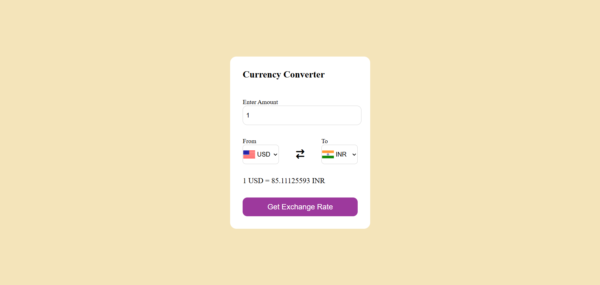
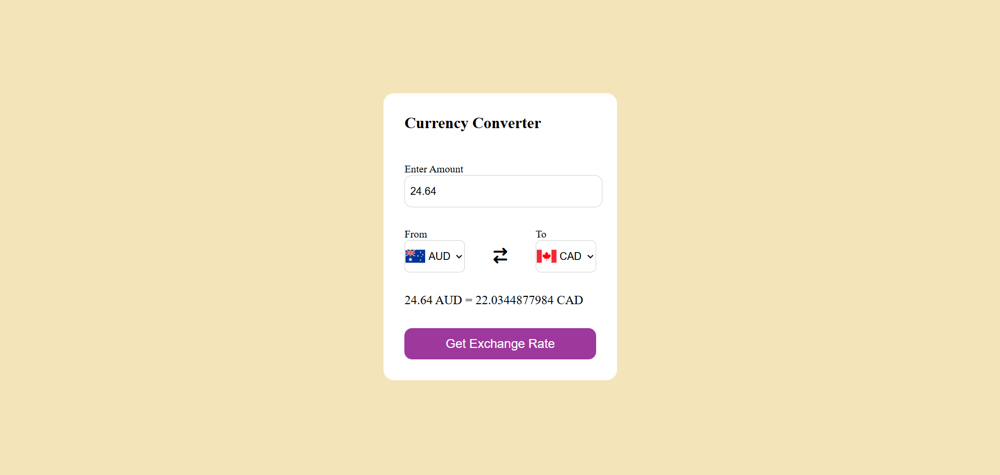

# 🌍 Currency Converter

This is a user-friendly **Currency Converter Web Application** that allows users to convert between currencies of over 150 countries in real-time.

🔗 **Live Website**: [https://currency-converter-delta-brown.vercel.app/](https://currency-converter-delta-brown.vercel.app/)  

## 🔧 Features

- 🌐 Supports 150+ world currencies
- 🔄 Real-time exchange rates using currency exchange API
- 💹 Instant and accurate conversion results
- 📱 Responsive and clean UI — works great on mobile and desktop
- 👨‍💻 Simple and easy-to-use interface

## 🚀 How It Works

1. Enter an amount.
2. Choose the source currency.
3. Choose the target currency.
4. Get the latest converted amount instantly.

## 🛠️ Built With

- HTML, CSS, JavaScript
- REST API (for exchange rates)
- Fetch API (or Axios)
- Responsive Web Design

## 📦 Installation

```bash
git clone https://github.com/yourusername/currency-converter.git
cd currency-converter
open index.html
````

Or simply open the `index.html` file in your browser.

## 📸 Screenshots




## 📄 License

This project is licensed under the [MIT License](LICENSE).
